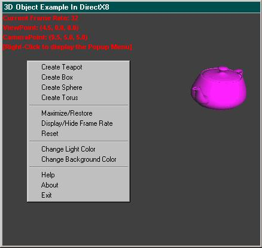



## A 3D Object Sample In DirectX8

### Description

This example made with DirectX8 demonstrates the power of D3DX by making teapots, spheres, boxes, and toruses(doughnuts)! Also, you can change the light to red, green, blue, white, black, purple, and two other shades of blue. You may change the backcolor to if you like. Please comment and vote! I will hopefully put the comments in shortly, have fun and enjoy!
 
### More Info
 

             |
---                |---
**Submitted On**   |2002-07-13 15:57:48
**By**             |[Mike Gerwitz](https://github.com/Planet-Source-Code/PSCIndex/blob/master/ByAuthor/mike-gerwitz.md)
**Level**          |Intermediate
**User Rating**    |4.9 (34 globes from 7 users)
**Compatibility**  |VB 6\.0
**Category**       |[DirectX](https://github.com/Planet-Source-Code/PSCIndex/blob/master/ByCategory/directx__1-44.md)
**World**          |[Visual Basic](https://github.com/Planet-Source-Code/PSCIndex/blob/master/ByWorld/visual-basic.md)
**Archive File**   |[A\_3D\_Objec1082857192002\.zip](https://github.com/Planet-Source-Code/mike-gerwitz-a-3d-object-sample-in-directx8__1-37072/archive/master.zip)

